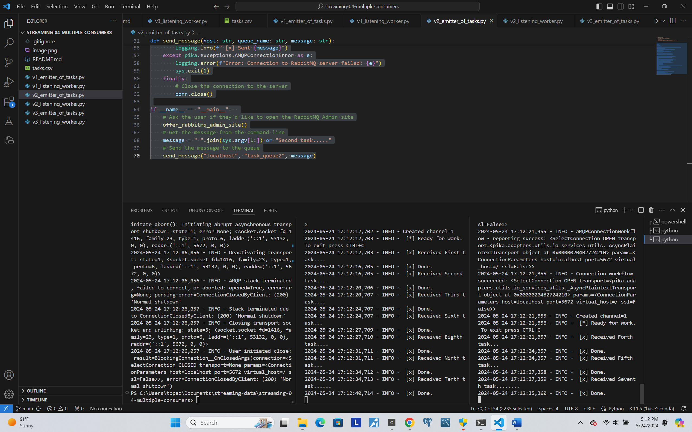

# streaming-04-multiple-consumers

# Name: Topaz Montague

# Project Repository: [Project 4 - Streaming Multiple Consumers](https://github.com/tfmontague/streaming-04-multiple-consumers)

## Project Objectives

> Use RabbitMQ to distribute tasks to multiple workers

One process will create task messages. Multiple worker processes will share the work. 

## Before You Begin

1. Fork this starter repo into your GitHub: https://github.com/tfmontague/streaming-04-multiple-consumers
1. Clone your repo down to your machine. `git clone https://github.com/your-username/streaming-04-multiple-consumers`
1. Open the Command Palette in Visual Studio Code by either clicking on View in the top menu and selecting Command Palette..., or by using the keyboard shortcut `Ctrl+Shift+P`.
1. In the Command Palette, start typing `Python: Select Interpreter`. You should see an option that matches. Click on it to proceed.
1. Select your conda environment. `~\anaconda3\python.exe`

## Read

1. Read the [RabbitMQ Tutorial - Work Queues](https://www.rabbitmq.com/tutorials/tutorial-two-python.html)
1. Read the code and comments in this repo: [Project 4 - Streaming Multiple Consumers](https://github.com/tfmontague/streaming-04-multiple-consumers)

# Version 1 Files

## Execute the Producer

1. Run emitter_of_tasks.py `python v1_emitter_of_tasks.py` (say y to monitor RabbitMQ queues)

Explore the RabbitMQ website.

## Execute a Consumer / Worker

1. Run listening_worker.py `python v1_listening_worker.py`

## Ready for Work

1. Use your emitter_of_tasks to produce more task messages. `python v1_emitter_of_tasks.py`

## Start Another Listening Worker 

1. Use your listening_worker.py script to launch a second worker. `python v1_listening_worker.py`

# Version 2 Files

## Modify Version 2 Files

1. Refactor version 2 files to logging using the built in logger instead of print statements

Refactored v2 Producer File
```python

# Import necessary modules

import pika
import sys
import webbrowser
import logging

# Configure logging
logging.basicConfig(level=logging.INFO, format='%(asctime)s - %(levelname)s - %(message)s')

def offer_rabbitmq_admin_site():
    """Offer to open the RabbitMQ Admin website"""
    ans = input("Would you like to monitor RabbitMQ queues? y or n ")
    logging.info("")
    if ans.lower() == "y":
        webbrowser.open_new("http://localhost:15672/#/queues")
        logging.info("Opening RabbitMQ Admin website")
        logging.info("")

def send_message(host: str, queue_name: str, message: str):
    """
    Creates and sends a message to the queue each execution.
    This process runs and finishes.

    Parameters:
        host (str): the host name or IP address of the RabbitMQ server
        queue_name (str): the name of the queue
        message (str): the message to be sent to the queue
    """
    try:
        # Create a blocking connection to the RabbitMQ server
        conn = pika.BlockingConnection(pika.ConnectionParameters(host))
        # Use the connection to create a communication channel
        ch = conn.channel()
        # Use the channel to declare a durable queue
        ch.queue_declare(queue=queue_name, durable=True)
        # Use the channel to publish a message to the queue
        ch.basic_publish(
            exchange="",
            routing_key=queue_name,
            body=message,
            properties=pika.BasicProperties(delivery_mode=pika.spec.PERSISTENT_DELIVERY_MODE)
        )
        # Log a message to the console for the user
        logging.info(f" [x] Sent {message}")
    except pika.exceptions.AMQPConnectionError as e:
        logging.error(f"Error: Connection to RabbitMQ server failed: {e}")
        sys.exit(1)
    finally:
        # Close the connection to the server
        conn.close()

if __name__ == "__main__":  
    # Ask the user if they'd like to open the RabbitMQ Admin site
    offer_rabbitmq_admin_site()
    # Get the message from the command line
    message = " ".join(sys.argv[1:]) or "Second task....."
    # Send the message to the queue
    send_message("localhost", "task_queue2", message)
```

Refactored v2 Consumer File
```python

# Import necesssary modules

import pika
import sys
import time
import logging

# Configure logging
logging.basicConfig(level=logging.INFO, format='%(asctime)s - %(levelname)s - %(message)s')

# Define a callback function to be called when a message is received
def callback(ch, method, properties, body):
    """ Define behavior on getting a message."""
    # Decode the binary message body to a string
    logging.info(f" [x] Received {body.decode()}")
    # Simulate work by sleeping for the number of dots in the message
    time.sleep(body.count(b"."))
    # When done with task, tell the user
    logging.info(" [x] Done.")
    # Acknowledge the message was received and processed 
    # (now it can be deleted from the queue)
    ch.basic_ack(delivery_tag=method.delivery_tag)

# Define a main function to run the program
def main(hn: str = "localhost", qn: str = "task_queue"):
    """ Continuously listen for task messages on a named queue."""

    # When a statement can go wrong, use a try-except block
    try:
        # Create a blocking connection to the RabbitMQ server
        connection = pika.BlockingConnection(pika.ConnectionParameters(host=hn))

    # Except, if there's an error, do this
    except Exception as e:
        logging.error("ERROR: connection to RabbitMQ server failed.")
        logging.error(f"Verify the server is running on host={hn}.")
        logging.error(f"The error says: {e}")
        sys.exit(1)

    try:
        # Use the connection to create a communication channel
        channel = connection.channel()

        # Use the channel to declare a durable queue
        channel.queue_declare(queue=qn, durable=True)

        # Set the prefetch count to one to limit the number of messages 
        # being consumed and processed concurrently.
        channel.basic_qos(prefetch_count=1) 

        # Configure the channel to listen on a specific queue,  
        # use the callback function named callback,
        # and do not auto-acknowledge the message (let the callback handle it)
        channel.basic_consume(queue=qn, on_message_callback=callback)

        # Log a message to the console for the user
        logging.info(" [*] Ready for work. To exit press CTRL+C")

        # Start consuming messages via the communication channel
        channel.start_consuming()

    # Except, in the event of an error OR user stops the process, do this
    except Exception as e:
        logging.error("ERROR: something went wrong.")
        logging.error(f"The error says: {e}")
        sys.exit(1)
    except KeyboardInterrupt:
        logging.info("User interrupted continuous listening process.")
        sys.exit(0)
    finally:
        logging.info("Closing connection. Goodbye.")
        connection.close()

# Standard Python idiom to indicate main program entry point
# This allows us to import this module and use its functions
# without executing the code below.
# If this is the program being run, then execute the code below
if __name__ == "__main__":
    # Call the main function with the information needed
    main("localhost", "task_queue2")

```

## Execute the Producer

1. Run emitter_of_tasks.py `python v2_emitter_of_tasks.py` (say y to monitor RabbitMQ queues)

Explore the RabbitMQ website.

## Execute a Consumer / Worker

1. Run listening_worker.py `python v2_listening_worker.py`

## Ready for Work

1. Use your emitter_of_tasks to produce more task messages. `python v2_emitter_of_tasks.py`

## Start Another Listening Worker 

1. Use your listening_worker.py script to launch a second worker. `python v2_listening_worker.py`

# Version 3 Files

## Create & Modify Version 3 Files

1. Copy version 2 files and rename as v3 accordingly
`v3_emitter_of_tasks.py`
`v3_listening_worker.py`
1. Refactor new renamed version 3 files to read from `tasks.csv` instead of the console, and open the RabbitMQ webpage without asking

Refactored v3 Producer File

```python

# Import necessary modules

import pika
import sys
import csv
import webbrowser
import logging

# Configure logging
logging.basicConfig(level=logging.INFO, format='%(asctime)s - %(levelname)s - %(message)s')

def open_rabbitmq_admin_site():
    """Open the RabbitMQ Admin website automatically."""
    webbrowser.open_new("http://localhost:15672/#/queues")
    logging.info("Opened RabbitMQ Admin site")

def get_messages_from_csv(file_path: str):
    """
    Reads messages from a CSV file.

    Parameters:
        file_path (str): The path to the CSV file containing messages.

    Returns:
        list: A list of messages read from the CSV file.
    """
    messages = []
    try:
        with open(file_path, mode='r') as file:
            reader = csv.reader(file)
            for row in reader:
                if row:
                    messages.append(row[0])
        logging.info(f"Successfully read messages from {file_path}")
    except FileNotFoundError:
        logging.error(f"Error: The file {file_path} was not found.")
        sys.exit(1)
    return messages

def send_message(host: str, queue_name: str, message: str):
    """
    Creates and sends a message to the queue each execution.
    This process runs and finishes.

    Parameters:
        host (str): The host name or IP address of the RabbitMQ server.
        queue_name (str): The name of the queue.
        message (str): The message to be sent to the queue.
    """
    try:
        # Create a blocking connection to the RabbitMQ server
        conn = pika.BlockingConnection(pika.ConnectionParameters(host))
        # Use the connection to create a communication channel
        ch = conn.channel()
        # Use the channel to declare a durable queue
        ch.queue_declare(queue=queue_name, durable=True)
        # Use the channel to publish a message to the queue
        ch.basic_publish(exchange="", routing_key=queue_name, body=message)
        # Log a message to the console for the user
        logging.info(f" [x] Sent {message}")
    except pika.exceptions.AMQPConnectionError as e:
        logging.error(f"Error: Connection to RabbitMQ server failed: {e}")
        sys.exit(1)
    finally:
        # Close the connection to the server
        conn.close()

# Standard Python idiom to indicate main program entry point
if __name__ == "__main__":
    open_rabbitmq_admin_site()
    file_path = 'tasks.csv'
    messages = get_messages_from_csv(file_path)
    for message in messages:
        send_message("localhost", "task_queue2", message)

```

## Execute the Producer

1. Run emitter_of_tasks.py `python v3_emitter_of_tasks.py` (say y to monitor RabbitMQ queues)

Explore the RabbitMQ website.

## Execute a Consumer / Worker

1. Run listening_worker.py `python v3_listening_worker.py`

## Ready for Work

1. Use your emitter_of_tasks to produce more task messages. `python v3_emitter_of_tasks.py`

## Start Another Listening Worker 

1. Use your listening_worker.py script to launch a second worker. `python v3_listening_worker.py`


## Reference

- [RabbitMQ Tutorial - Work Queues](https://www.rabbitmq.com/tutorials/tutorial-two-python.html)


## Screenshot

See a running example with at least 3 concurrent process windows here:

